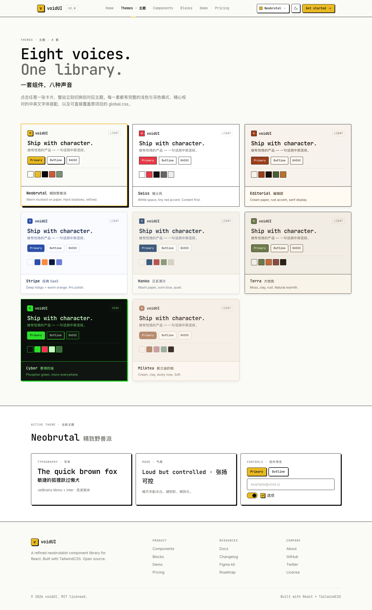
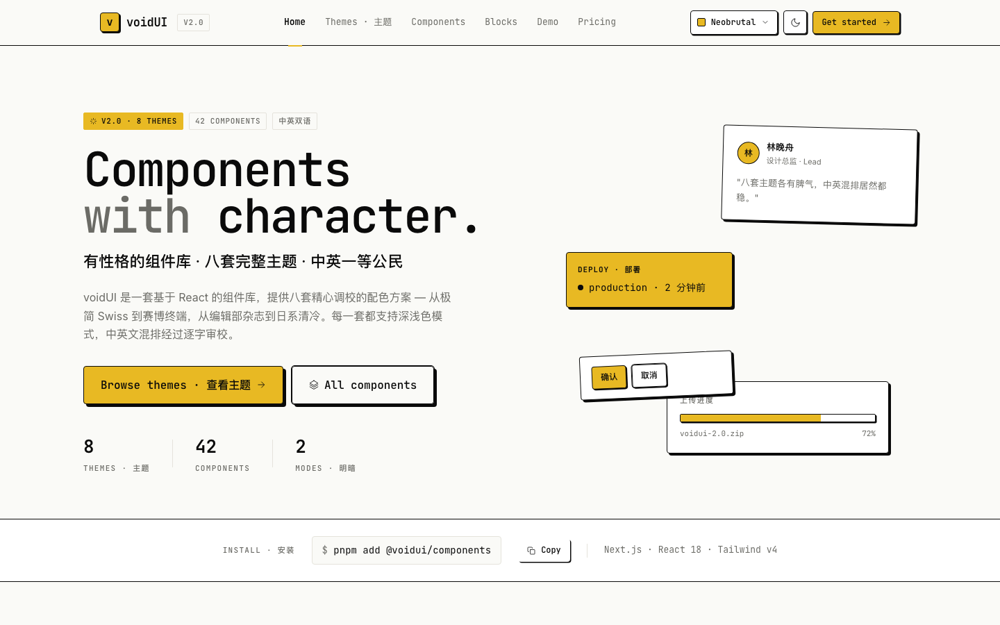
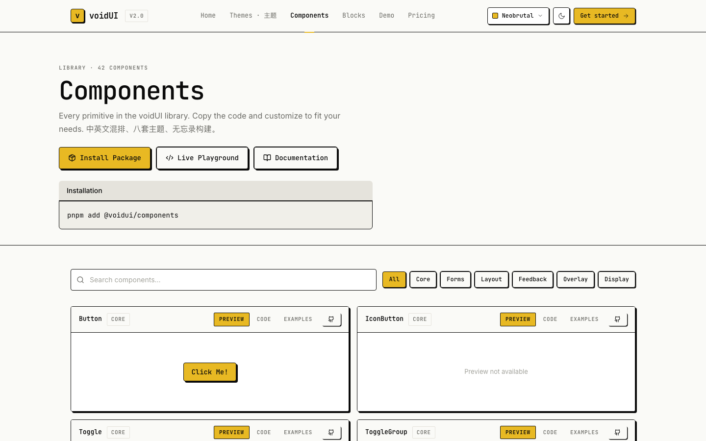

# voidUI — Void Styled React Component Library

voidUI is a production-grade React component library built on **TailwindCSS v4** and **Radix UI primitives**. It ships **8 hand-tuned themes × light/dark**, first-class **bilingual CJK** support, and a void-flavored neobrutalist DNA that stays sharp at every scale.

Every visual token (color, radius, shadow, font stack) resolves per theme from CSS variables, so switching themes is a single attribute swap with **zero Tailwind rebuild**.

Live preview: https://jiji262.github.io/voidUI/ · npm: [`@voidui/components`](https://www.npmjs.com/package/@voidui/components)

---

## 📦 Install

```bash
pnpm add @voidui/components
# or
npm install @voidui/components
# or
yarn add @voidui/components
```

Peers: `react ^18 || ^19`, `react-dom ^18 || ^19`. TailwindCSS v4 on the consumer side (you drive the theme tokens via CSS vars — copy `app/global.css` or import your own token sheet).

### Use

```tsx
import { Button, Card, Alert, AlertTitle } from "@voidui/components";

export default function Page() {
  return (
    <Card className="p-6">
      <Alert variant="info">
        <AlertTitle>Ready to ship</AlertTitle>
      </Alert>
      <Button className="mt-4">Get started</Button>
    </Card>
  );
}
```

Every component is a client component; they ship with `"use client"` preserved so you can import them from Next.js server components directly.

### Theming

Drop the token sheet in your global styles and set `data-theme` + `data-mode` on `<html>`:

```html
<html data-theme="neobrutal" data-mode="light">
```

8 theme ids: `neobrutal` · `swiss` · `editorial` · `stripe` · `hanko` · `terra` · `cyber` · `milktea`.
Modes: `light` · `dark`.

Copy `app/global.css` from the repo for a working baseline with every token already wired.

---

## 🧑‍💻 Local development

This repo is a monorepo-of-two: the publishable library in `components/voidui/` and a Next.js demo / documentation site in `app/`.

```bash
pnpm install
pnpm dev           # Next.js demo at http://localhost:3000
pnpm typecheck     # tsc --noEmit
pnpm test          # vitest run
pnpm build:lib     # tsup → dist/ (publishable artifacts)
pnpm publint       # lint package.json for npm correctness
pnpm build         # next build (static export if GITHUB_PAGES=true)
```

---

## 🎨 Features

- **8 themes** — `neobrutal` · `swiss` · `editorial` · `stripe` · `hanko` · `terra` · `cyber` · `milktea`
- **Light + dark** per theme, switched independently via `data-mode`
- **40+ CSS-variable tokens** — `--primary`, `--border-subtle`, `--sh-md`, `--r-lg`, `--font-sans-active`, ...
- **Bilingual CJK** — Latin-to-Simplified-Chinese fallbacks baked into every font stack; `:lang(zh)` gets looser leading + tracking automatically
- **6 Google fonts self-hosted** via `next/font` — Inter / JetBrains Mono / Fraunces / IBM Plex Mono / Noto Sans SC / Noto Serif SC
- **30+ components** — form · display · feedback · layout · overlay
- **Fully typed** — TypeScript everywhere, no `any` leaks
- **Accessible** — Radix UI under the hood for focus, keyboard, ARIA
- **Zero FOUC** — inline init script syncs `data-theme` / `data-mode` on `<html>` before React hydrates

---

## 📱 Pages

| Route | Purpose |
|---|---|
| `/` | Landing page with hero + feature grid + dark CTA |
| `/components` | Searchable component gallery with Preview / Code / Examples tabs |
| `/themes` | **All 8 themes rendered side-by-side** with active-theme detail row |
| `/theme-demo` | Theme sandbox — exercise the active theme across buttons, forms, alerts, color tokens |
| `/demo` | Interactive playground across all preview variants |
| `/blocks` | Page-level block templates (hero, pricing, auth, etc.) |
| `/pricing` | Pricing table example |

### Preview — `/themes`

All 8 themes on one page, each rendered in a scoped `data-theme` tile. Click any card to activate that theme site-wide.



<details>
<summary>More screenshots</summary>

**Home — `/`**



**Components — `/components`**



</details>

---

## 🧩 Component Library

**Form** — Button · IconButton · Input · Textarea · Label · Checkbox · Radio · Switch · Slider · Select · Toggle · ToggleGroup
**Display** — Card · BasicCard · ProductCard · Badge · Avatar · Text · Progress · CommandDisplay
**Feedback** — Alert · Tooltip · Sonner (Toast)
**Layout** — Accordion · Tab · Table · Breadcrumb
**Overlay** — Dialog · Popover · Menu

Every component is a single file in `components/voidui/` and is re-exported from [`components/voidui/index.ts`](./components/voidui/index.ts).

---

## 🎨 Theme System

Themes are driven by **two data attributes on `<html>`** — that's the entire API:

```tsx
<html data-theme="neobrutal" data-mode="light">
```

### Available themes

| ID | Label | DNA |
|---|---|---|
| `neobrutal` | Neobrutal | Hard-edged mustard, chunky borders, offset shadows — default |
| `swiss` | Swiss | Grid-first, sharp red accents, zero radius, hairline borders |
| `editorial` | Editorial | Warm cream, serif display (Fraunces), soft shadows |
| `stripe` | Stripe | Calm navy product UI with layered soft shadows |
| `hanko` | Hanko | Japanese-inspired muted blue on warm cream |
| `terra` | Terra | Earthy olive-green with warm clay undertones |
| `cyber` | Cyber | Monospaced high-contrast terminal palette |
| `milktea` | Milk Tea | Soft rose-beige with generous radius |

Full metadata lives in [`lib/theme-config.ts`](./lib/theme-config.ts); raw token values are in [`app/global.css`](./app/global.css).

### Switching themes in-app

Use the `useTheme` hook from `@/lib/theme-context`:

```tsx
"use client";
import { useTheme } from "@/lib/theme-context";

export function MyThemePicker() {
  const { theme, mode, setTheme, toggleMode } = useTheme();
  return (
    <>
      <select value={theme} onChange={(e) => setTheme(e.target.value as any)}>
        {/* 8 theme IDs */}
      </select>
      <button onClick={toggleMode}>{mode === "dark" ? "☀" : "🌙"}</button>
    </>
  );
}
```

The provider persists to `localStorage` (`voidui-theme`, `voidui-mode`) and rehydrates on reload.

### Scoped theming (show two themes at once)

Because every theme is `[data-theme="..."]` scoped in CSS, you can nest a different theme inside any subtree — see [`app/themes/page.tsx`](./app/themes/page.tsx) for a live example rendering all 8 side-by-side:

```tsx
<div data-theme="cyber" data-mode="dark" className="bg-background text-foreground">
  {/* anything here renders in cyber/dark, regardless of the page-level theme */}
</div>
```

### Token reference (partial)

| Token | Purpose |
|---|---|
| `--bg`, `--bg-elev` | Page and elevated surfaces |
| `--fg`, `--fg-muted`, `--fg-subtle` | Text hierarchy |
| `--card` | Card background |
| `--primary`, `--primary-hover`, `--primary-fg` | CTA color + on-primary |
| `--border`, `--border-subtle` | Strong vs. hairline dividers |
| `--success`, `--danger`, `--warning`, `--info` | Semantic |
| `--r-sm`, `--r`, `--r-md`, `--r-lg` | Radius scale |
| `--sh-xs` … `--sh-xl` | Shadow scale (hard-offset on brutalist/cyber, soft-blur elsewhere) |
| `--font-sans-active`, `--font-mono-active`, `--font-display-active` | Active family stacks with CJK fallbacks |

Tailwind aliases (`bg-primary`, `text-foreground-muted`, `border-border-subtle`, `shadow-md`, `rounded-md`) are all wired via `@theme` — just use Tailwind normally.

---

## 🤖 Using voidUI in AI IDEs

voidUI is designed to be AI-friendly: a small, stable API surface, strict token names, and a single entry point (`@/components/voidui`). Drop one of the rule files below into your project root to get AI agents to produce on-brand code from day one.

### The universal rule (reuse for any agent)

Copy this into whichever rule file your IDE reads:

````md
## voidUI component library

This project uses voidUI (`components/voidui/`, TailwindCSS v4, Radix UI). Follow these rules **always**:

1. **Single import path** — import every component from `@/components/voidui`:
   ```tsx
   import { Button, Card, Badge, Alert, AlertTitle } from "@/components/voidui";
   ```
   Never reach into `@/components/voidui/Button` unless you need tree-shaking in an isolated preview.

2. **Use tokens, not raw colors** — never hard-code hex, RGB, or Tailwind color classes like `bg-blue-500`. Use:
   - `bg-primary` / `text-primary-foreground`
   - `bg-background` / `text-foreground` / `text-muted-foreground`
   - `border-border` / `border-border-subtle`
   - `bg-destructive` / `text-destructive-foreground`

3. **Use the shadow + radius scale** — `shadow-xs|sm|md|lg|xl|2xl` and `rounded-sm|md|lg`. Each theme interprets these differently (neobrutal = hard offset, stripe = soft blur). Never hard-code a custom shadow.

4. **Border width** — voidUI v2 uses `1.5px` not `2px`. Prefer the default border from components; if you need a raw `border`, use `border-[1.5px]`.

5. **Typography** — use the `Text` component with `as="h1".."small"` for headings/body. Mono headings (`font-mono`) are the voidUI voice. `font-sans` for body, `font-display` for hero.

6. **CJK text** — wrap Chinese strings with `lang="zh"` or the `.cn` class to pick up looser leading/tracking:
   ```tsx
   <p className="cn">交付到生产</p>
   ```

7. **Theming** — never set colors/shadows per-theme in component code. If a new theme is needed, add it to `app/global.css` and `lib/theme-config.ts`, not inline.

8. **Do not import from `packages/voidui/`** — that path is legacy.

Reference: [`app/themes/page.tsx`](./app/themes/page.tsx) shows all tokens in action across 8 themes. [`components/voidui/Button.tsx`](./components/voidui/Button.tsx) is the canonical example of a variant-driven component.
````

### Claude Code (`CLAUDE.md`)

Create `CLAUDE.md` at the repo root and paste the universal rule above into it. Claude Code reads this file automatically at session start. You can also add project-specific nudges:

```md
# Project: voidUI consumer app

<paste universal rule here>

## Workflow

- Before building UI, check `/themes` (`http://localhost:3000/themes`) to pick the right theme direction.
- Prefer new pages that compose existing voidUI primitives over custom markup.
- Use `/browse` skill to screenshot a page before claiming UI work is done.
```

Claude Code also respects subdirectory `CLAUDE.md` files, so you can tighten rules per-feature.

### Cursor (`.cursorrules`)

Cursor reads `.cursorrules` (single file) or `.cursor/rules/*.mdc` (scoped rules). Paste the universal rule into `.cursorrules`. Example with a scoped rule:

```
.cursor/rules/voidui.mdc
----
description: voidUI component and token rules
globs: ["**/*.tsx", "**/*.ts"]
alwaysApply: true
---

<paste universal rule here>
```

### OpenAI Codex (`AGENTS.md`)

The OpenAI Codex CLI and Codex cloud agent both read `AGENTS.md` from the repo root. Paste the universal rule there. Codex also supports nested `AGENTS.md` files — useful if `app/blocks/` has different rules than `app/themes/`.

```md
# AGENTS.md

<paste universal rule here>

## When running the app

- `pnpm dev` starts Next.js on :3000
- `pnpm build` must pass before any PR
- Do NOT modify `packages/voidui/` — it is a legacy mirror
```

### GitHub Copilot (`.github/copilot-instructions.md`)

Copilot reads `.github/copilot-instructions.md` at the repo root. Paste the universal rule. Copilot Chat in VS Code and on github.com both pick this up.

### Windsurf / other agents

Most agents fall back to `AGENTS.md`. If yours reads something else, point its rule file to the same content.

### Verifying rules take effect

Ask your agent to build a trivial UI and grep the diff for violations:

```bash
git diff | grep -E 'bg-(blue|red|gray|slate|zinc)-[0-9]|border-\[2px\]|rounded-\[0px\]'
```

If that prints anything, the agent isn't following the rules — tighten the prompt or move to a different rule file format.

---

## 📦 Component Usage

```tsx
import { Button, Card, Badge, Alert, AlertTitle, AlertDescription } from "@/components/voidui";

export function Pitch() {
  return (
    <Card className="p-6 max-w-md">
      <Card.Header>
        <Card.Title>Ship faster</Card.Title>
        <Card.Description>8 themes, one API.</Card.Description>
      </Card.Header>
      <Card.Content className="flex gap-2">
        <Button>Get started</Button>
        <Button variant="outline">Docs</Button>
      </Card.Content>
    </Card>
  );
}
```

Both the **dot-API** (`Card.Header`) and the **flat named exports** (`CardHeader`) work — pick whichever your codebase prefers.

---

## 🛠 Development

### Project layout

```
app/
├── page.tsx           # landing
├── layout.tsx         # root layout (ThemeProvider, FOUC script, fonts)
├── global.css         # 8-theme token system
├── themes/            # all-themes side-by-side preview
├── theme-demo/        # deep theme showcase
├── showcase/          # component showcase with Preview/Code/Examples tabs
├── demo/              # interactive playground
├── components/        # components reference page
└── blocks/            # page-level block templates

components/
├── voidui/            # ← the component library
├── ui/                # app-only helpers (toast, code-block, theme-switcher)
├── TopNav.tsx
└── HamburgerMenu.tsx

lib/
├── theme-config.ts    # 8 theme IDs + metadata
├── theme-context.tsx  # ThemeProvider + useTheme hook
└── utils.ts           # cn() helper (twMerge + clsx)

preview/components/    # one file per component variant, rendered in /demo + /components
public/                # static assets
```

### Adding a component

1. Create `components/voidui/YourComponent.tsx` using `cva` for variants.
2. Re-export from `components/voidui/index.ts`.
3. Add preview variants in `preview/components/`.
4. Register it in `lib/component-categorization.ts` and `lib/component-code-examples.ts`.

### Adding a theme

1. Append the full token block to `app/global.css` under a new `[data-theme="yourtheme"]` selector (plus the `[data-mode="dark"]` companion).
2. Append the ID + metadata to `THEMES` and `THEME_META` in `lib/theme-config.ts`.
3. Done — `/themes` and the theme switcher pick it up automatically.

---

## 📚 Key Dependencies

- **Next.js 14** (App Router)
- **React 18**
- **TailwindCSS v4** (`@tailwindcss/postcss`, `@theme` directive)
- **Radix UI** primitives for accessible behavior
- **Class Variance Authority** (`cva`) for variant management
- **Lucide React** icons
- **Sonner** for toasts
- **Google Fonts** via `next/font` (self-hosted)

---

## 🌗 Dark Mode

Dark mode is an **orthogonal axis** to theme — every theme ships tuned darks. Toggle via `data-mode="dark"` on `<html>`; in-app use the `toggleMode()` from `useTheme()`.

Tailwind `dark:` variants still work — they're rewired by the `@custom-variant dark (&:where([data-mode="dark"], [data-mode="dark"] *))` line at the top of `app/global.css`.

---

## 🎯 Best Practices

1. **Compose, don't fork** — most UI needs are a composition of existing components.
2. **Tokens > hex** — never hard-code colors; stick to CSS variables / Tailwind aliases.
3. **Test both modes** — `/themes` makes this a one-click check for all 8 × 2.
4. **Respect `prefers-reduced-motion`** — `app/global.css` already disables transitions for users who ask.
5. **Use `lang="zh"` or `.cn`** for any Chinese string longer than a single word.

---

## 📄 License

MIT — use it, fork it, ship it.

## 🤝 Contributing

PRs welcome. Run `pnpm build && pnpm lint` before opening one.
