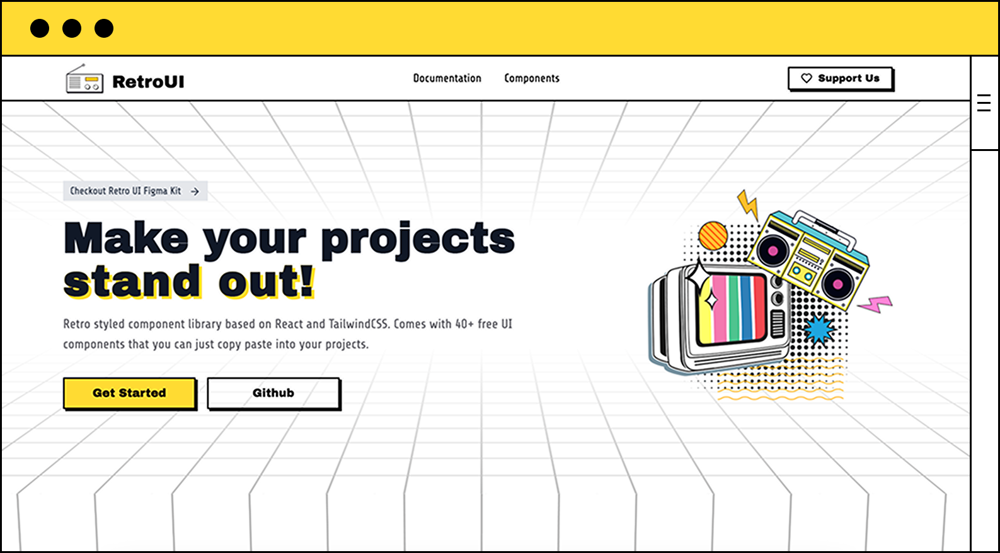

# RetroUI - Retro Styled React Component Library



RetroUI is a retro-styled React component library built with TailwindCSS. It provides a collection of reusable UI components with a nostalgic aesthetic, perfect for creating unique, memorable user interfaces. This repository serves as both a component showcase and a library of ready-to-use components.

## 🚀 Quick Start

```bash
# Install dependencies
pnpm install

# Start development server
pnpm dev

# Build for production
pnpm build

# Run linting
pnpm lint
```

Visit `http://localhost:3000` to see the component showcase in action.

## 🎨 Features

- **Retro Aesthetic**: High-contrast colors, bold borders, and pixel-perfect design
- **Theming System**: Switch between multiple color themes with ease
- **Dark Mode Support**: Automatic adaptation to light and dark modes
- **Component Library**: 30+ ready-to-use components
- **Fully Responsive**: Works on all device sizes
- **TypeScript Support**: Full type safety for all components
- **Accessible**: Built with accessibility in mind using Radix UI primitives

## 📱 Pages

- **Home (`/`)** - Main showcase with all components displayed
- **Components (`/components`)** - Detailed component gallery organized by category
- **Demo (`/demo`)** - Interactive playground for testing components

## 🧩 Component Library

### Form Components
- Buttons (default, outline, secondary, with icons)
- Input fields and textareas
- Checkboxes with variants
- Radio buttons
- Select dropdowns
- Switches and toggles
- Sliders

### Display Components
- Badges and status indicators
- Avatars with different sizes
- Cards and testimonials
- Alerts and notifications
- Progress bars
- Tooltips

### Navigation Components
- Tabs interface
- Accordion sections
- Dropdown menus
- Breadcrumb navigation
- Toggle groups

### Data Components
- Tables (default, with checkboxes, sticky headers)
- Typography and text styles

### Interactive Components
- Dialogs and modals
- Popovers
- All form controls with live interaction

## 🎨 Theme System

RetroUI supports multiple color themes that can be easily switched by users.

### Available Themes

1. **Default Theme** - The original RetroUI theme with yellow (`#ffdb33`) as the primary color
2. **Purple Theme** - A new theme with purple (`#624aff`) as the primary color

### Using Predefined Themes

RetroUI comes with two predefined themes that can be switched using the theme switcher in the navigation bar.

### Creating Custom Themes

You can create completely custom themes using the theme configuration system:

```tsx
import { createCustomTheme, applyRetroUITheme } from '@retroui/components/theme-config';

// Create a custom blue theme
const blueTheme = createCustomTheme(
  '#3b82f6', // primary
  '#2563eb', // primaryHover
  '#ffffff'  // primaryForeground
);

// Apply the theme
applyRetroUITheme(blueTheme);
```

### Theme Configuration Properties

| Property | Description | Example |
|----------|-------------|---------|
| `primary` | Main brand color | `#ffdb33` |
| `primaryHover` | Primary color on hover | `#ffcc00` |
| `primaryForeground` | Text color on primary background | `#000000` |
| `secondary` | Secondary color | `#000000` |
| `secondaryForeground` | Text color on secondary background | `#ffffff` |
| `accent` | Accent color for highlights | `#ffcc00` |
| `accentForeground` | Text color on accent background | `#000000` |
| `background` | Page background color | `#ffffff` |
| `foreground` | Main text color | `#000000` |
| `card` | Card background color | `#ffffff` |
| `cardForeground` | Card text color | `#000000` |
| `muted` | Muted UI elements | `#aeaeae` |
| `mutedForeground` | Muted text color | `#5a5a5a` |
| `destructive` | Error/danger color | `#e63946` |
| `destructiveForeground` | Text on destructive background | `#ffffff` |
| `border` | Border color | `#000000` |

## 🛠 Development

This project has been optimized for component showcase and development:

- ✅ No content management dependencies
- ✅ Fast development and build times
- ✅ All components displayed on homepage
- ✅ Interactive component playground
- ✅ Organized component gallery
- ✅ Responsive design

### Project Structure

```
app/                 # Next.js app router pages
├── page.tsx         # Homepage/landing page
├── components/      # Component gallery page
├── demo/            # Interactive playground
└── layout.tsx       # Root layout

components/          # UI components
├── retroui/         # Main component library
└── preview/         # Component examples

preview/components/  # Individual component demos
lib/                 # Utility functions and helpers
public/              # Static assets
```

### Architecture Overview

The project follows a component-driven architecture:

1. **Component Library**: Located in `components/retroui/`, contains all reusable UI components built with React and TailwindCSS
2. **Component Showcase**: Three main pages demonstrate components:
   - Homepage (`/`) - Landing page with project overview
   - Components (`/components`) - Organized gallery of all components
   - Demo (`/demo`) - Interactive playground for testing components
3. **Preview Components**: Located in `preview/components/`, these are example implementations showing how to use each component

Components use:
- TailwindCSS for styling with a retro aesthetic
- Radix UI primitives for accessibility and functionality
- Class Variance Authority (cva) for variant management
- TypeScript for type safety

### Component Development

All components are in `components/retroui/` and:
1. Use cva for variant management
2. Export both component and interface
3. Are exported through `components/retroui/index.ts`
4. Have corresponding preview examples in `preview/components/`

To add a new component:
1. Create the component in `components/retroui/`
2. Export it in `components/retroui/index.ts`
3. Create preview examples in `preview/components/`
4. Add it to the categorization in `lib/component-categorization.ts`

## 📦 Component Usage

All components are available in the `/components/retroui` directory and can be imported directly:

```tsx
import { Button, Card, Badge } from "@/components/retroui";
```

### Key Dependencies

- Next.js 14 with App Router
- React 18
- TailwindCSS v4
- Radix UI primitives
- Class Variance Authority
- TypeScript
- Lucide React icons

## 🌗 Dark Mode Integration

RetroUI automatically adapts to dark mode. The dark mode toggle in the navigation bar switches between light and dark modes, and all themes automatically adjust their colors accordingly.

## 🎯 Best Practices

1. **Consistency**: Maintain consistent color relationships when creating custom themes
2. **Accessibility**: Ensure sufficient contrast between text and background colors
3. **Testing**: Test your themes in both light and dark modes
4. **Performance**: The build process is optimized for fast loading times
5. **Responsive Design**: All components are designed to work on all screen sizes

## 📄 License

MIT License - feel free to use RetroUI in your projects!

## 🤝 Contributing

Contributions are welcome! Please feel free to submit a Pull Request.